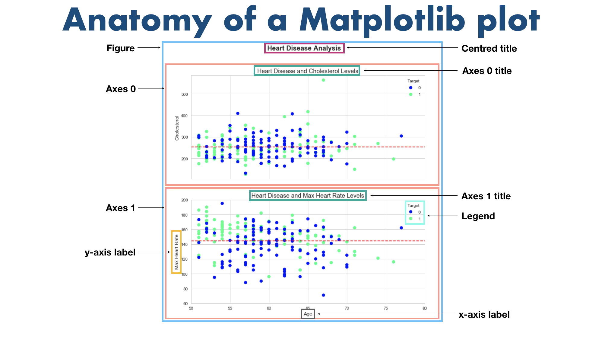

# Data Analysis

## Pandas

Pandas is a tool that almost every data scientist uses. It allows for easier exploration, alteration and visualisation of data, in table format. We usually import pandas with the abbrevation pd. 

### Series

Series are one dimensional objects that allow storing information.

### Data Frames

Data frames are two dimensional objects which combine multiple series together.

## Numpy

A package written in C which allows for quick data manipulation and transformations. Numpy allows us to
store and structure data in a way that machines understand and can use during an ML 
code. Numpy comes to the data analysis part of a machine learning model. This is useful due to 
the optimisations that Numpy has based on vectorisation via broadcasting.

### Datatypes and Attributes

1. Ndarray - an n dimensional array ( think of it as a tensor )

## Matplotlib

One of the most used visualisation tools in Python. It can be used in both the data analysis section
of the ML pipeline, or the Evaluation section at the end. 

### Some of the most useful types

1. Line plot
2. Scatter plot
3. Histogram
4. Bar Plot
5. Box/Violin plots
