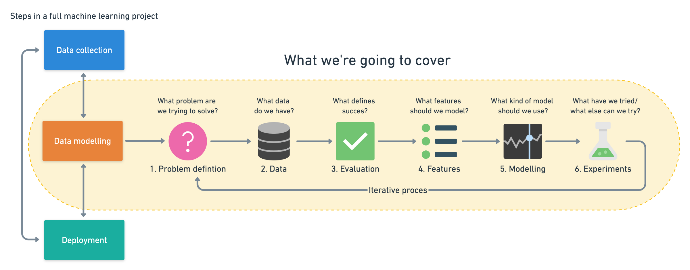
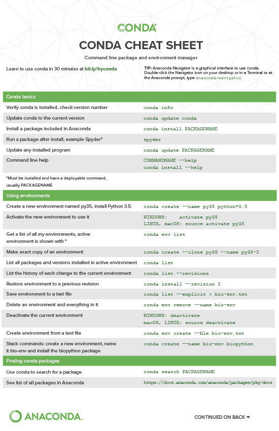
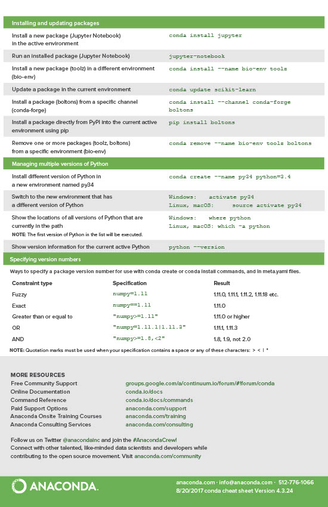

# Machine Learning and Data Science Framework

## Intro

Machine learning comes into 3 parts:

1. Data Collection
2. Data Modelling
3. Deployment

Steps we are going to cover in this course:

1. Create a framework
2. Match to data science and machine learning tools
3. Learn tools by working with them

## Machine Learning framework

It is important to build a framework when ti comes to ML, since it allows you to revisit
whenever you have a new project. This framework will be split into 6 steps:

### 1. Problem Definition
It is always important to define what problem you are trying to solve and figure out in which 
category your problem fits. The usual categories when it comes to ML problems are:

1. Supervised Learning
2. Unsupervised Learning
3. Classification
4. Regression

### 2. Data
Since Ml uses data, data are a requirement when it comes to an ML model. We should always 
try to understand our data before we dive into building a model, and a first step would be
classifying what kind of data we have. Two common types are:

#### 1. Structured Data 

Data that comes into different tables that exhibit some sort of relationships. Usually looks like what 
you'll find in an excel file.

#### 2. Unstructured Data.

Data that do not exhibit any patterns, like photos, emails, or audio-samples. 

Once we know what kind of data we have, we can start making decisions on what model we will create. The more data you 
usually have, the better it is for an ML model.

#### 3. Streaming data

Data that changes constantly. An example would be a stock price. These data are never static, and
the model might need to re-train frequently with the changes that your dataset has.

### 3. Evaluation

The perfect model does not exist, instead we always need to define an accuracy level and have something to 
aim for when we start building data. Different types of metrics are:

#### For Classification algorithms:
- Accuracy
- Precision
- Recall

#### For Regresion algorithms:
- Mean absolute error (MAE)
- Mean squared error (MSE)
- Root mean squared error (RMSE)

#### For Recommendations:
- Precision at K

### 4. Features

The data that we have that are passed into the ML model and used in order to make predictions. This is usually the 
section that we answer what do we already know about the data. Here we try to find what different forms of data within 
our data (an example is the different columns a structured dataset has). Features are split into 2 categories:

1. Numerical (Numbers)
2. Categorical (Classes)

### 5. Modelling

Based on our problem and data, which model should we use? Remember there are a lot of available models out
there, so there is no need for us to build models from scratch every time. There are three
sections to modelling:

#### Model Training

One of the most important points of your ML algorithm. Here we are teaching our model to do what we want it to do.
We usually split the data to train/validation/test sets, in order to check if our model has trained correctly 
, then we use the validation set to ensure the model works and tune it, and can make correct predictions to unseen data (test set).

#### Tuning a model

Changing some of your model's features, adjusting some of the hierarchical parameters, changing the layers. Remember that
a model's first results are not always it's last. 

#### Model Comparison
Using the test data, compare how the different versions of a model, or different models, work against eachother. A good 
model will usually yield a similar performance on test/train data. Some common issues with testing a model are
1. Underfitting: When the model performs worse on the test dataset rather than the training dataset. You can fix this by
   either changing the model, increase the hyperparameters, reduce the features or train for longer
2. Overfitting: When the model performs better on the test dataset rather than the training dataset. You can fix this by
   either collect more data, try less advance models, and ensure that there are is no data leakage.

The best model usually sits on what we call the Goldilock's zone (does not overfit or underfit). The performance should 
also usually take into account the speed of a model.

### 6. Experimentation

How could we improve? What can we try next? Remember that ML is a field that is constantly developing,
and sometimes we will not get the best model from the first attempt, or we might find something better 
afterwards. Iterating our model and changing once we find something new is one of the best ways to keep 
our model to as perfect as we can.

### When shouldn't you use ML

- Will a simple hand coded instruction based system work?

### Main types of ML

#### 1. Supervised Learning

A ML algorithm that uses labelled data in order to train how make predictions. It uses a labelled dataset
and trains with it to make predictions which it then cross-checks with the given label that each data point has.
It repeats the process until it learns how to predict those labels efficiently. Some types of supervised learning
are:

1. Classification: Grouping datasets into classes. It could be:
   1. A binary classification (only two classes)
   2. A multi-class classficiation (more than 2 classes)
    
2. Regression: Trying to predict a number from a pattern (usually a timeseries).

#### 2. Unsupervised Learning

An ML algorithm that uses data and tries to find patterns in the given data, without any given labels to compare 
to.

#### 3. Transfer Learning

Using pre-existing ML models and altering them in order to do a different task. ML training
is usually a time expensive task, so using a pre-configured/pre-trained model and manipulating 
it to do a different task is usually a good trick to have.

#### 4. Reinforcement Learning

Having a computer do a task and rewarding it when it does it well or punishing it when it doesn't.

#### 5. Deep Learning
A subfield of machine learning concerned with algorithms inspired by the structure and function of the brain called 
artificial neural networks.

### Things to Remember
- Some models work bettter than others on different problems.
- Don't be afraid to try things.
- Start small and build up (add complexity) as you need
- Avoid overfitting/underfitting
- Keep test set separate from the rest of the sets
- Compare apples to apples 
- Best performance metric does not necessarily correlate to the best model

## Environment Setup

### Anaconda

Anaconda is a virtual environment tool, that is a collection of available packages for python,
and allows for the creation of virtual environments that enable access to those packages, their versions, and 
the different python versions as well. 

#### Environments

Collection of tools/packages that we use for a project. Environment setups allows you to share
the code easily, allow other people to run your code with the same dependencies, and make the replication of your 
project easier.

Check the cheat sheets:

