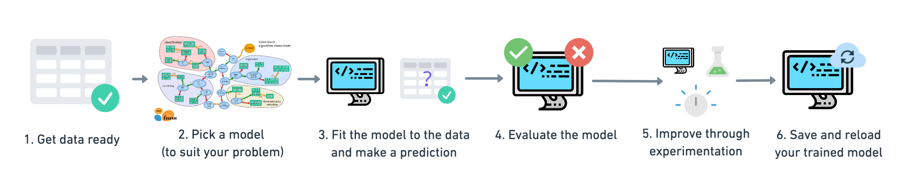

# Scikit Learn

Scikit learn is one of the most popular libraries when it comes to building ML models.
It is a library that has a variety of models, with easy to use API and a really friendly 
structure. 

## Workflow

A typical end to end sklearn workflow involves everything from gathering the data and preparing them
to pass them to the model, to picking the model and training it, and finally evaluating our results.

## Models

